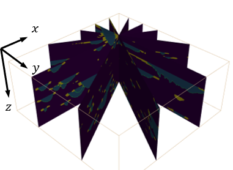

# Radial slice on 3D numpy array


# Requirements
Setup packages
```sh
pip install -r requirements.txt
```

# Documentation
## 1. Interpolation function
We call the scipy function [ RegularGridInterpolator ](https://docs.scipy.org/doc/scipy/reference/generated/scipy.interpolate.RegularGridInterpolator.html) to access the corresponding values of the points in 3darray.  
If the shape of your input volume (x,y,z) = (64,64,30), then
```sh
x = np.linspace(0, 63, 64)
y = np.linspace(0, 63, 64)
z = np.linspace(0, 29, 30)
```
Accessing the value on the position (x,y,z) = (2.1, 6.2, 8.3)
```sh
my_interpolating_function = RegularGridInterpolator((c, a, b), volume)
point = np.array([2.1, 6.2, 8.3])
value = my_interpolating_function(point)
```

## 2. Slice 
We want to take the radial slice around the center point lied on z=0 plane, and take the z-axis as the rotation axis. 
The following image is the examples which refer to [documentations of pyvista](https://docs.pyvista.org/examples/01-filter/slicing.html).



### Boundary points on xy-plane
We define the geometric objects (lines, rotated lines, frame) with [Shapely](https://shapely.readthedocs.io/en/stable/manual.html).  
Then take the two interseions as the boundary of the slice image. 
```sh
# xy- plane frame
enface = LineString([(0, 0), (0, nc-1), (nb-1, nc-1), (nb-1,0), (0,0)])
# horizontal line
lineObj = LineString( [(0-100, rotate_center[1]),(nb+100, rotate_center[1])] )
# intersectiona
intersections = enface.intersection(lineObj)
```
> Note: The order of the intersections is sorted by the x-value of the points.  

### points representing the slice
The we use the boundary points to define a new index sequence representing the 
positions of the slicing images.

```sh
# xy- plane frame
index_x = np.linspace(p1x, p2x, output_w, dtype=np.float16)
index_y = np.linspace(p1y, p2y, output_w, dtype=np.float16)
```
